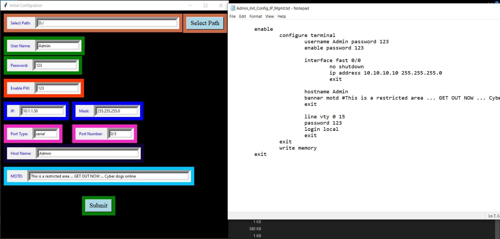
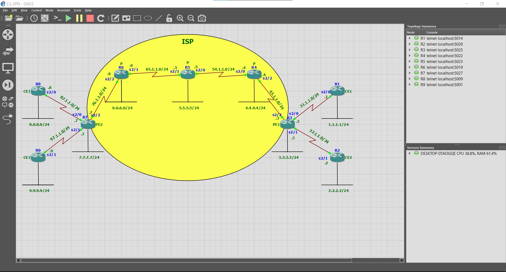
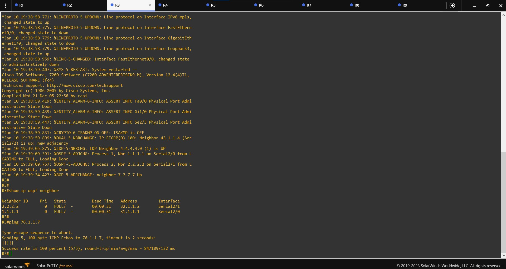
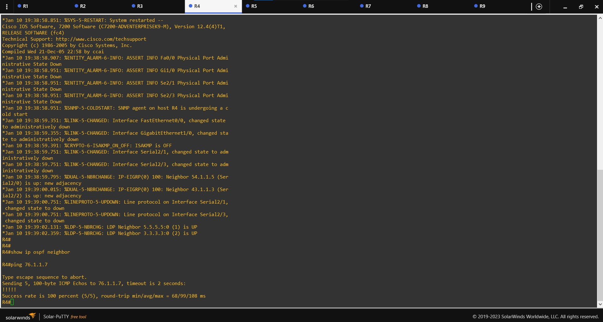
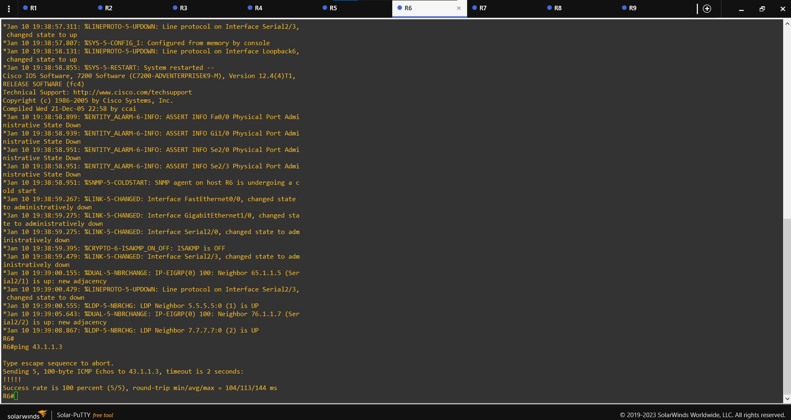
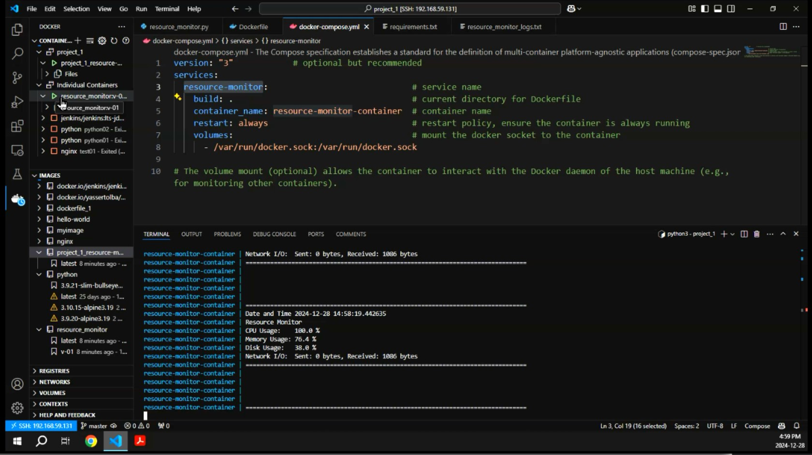
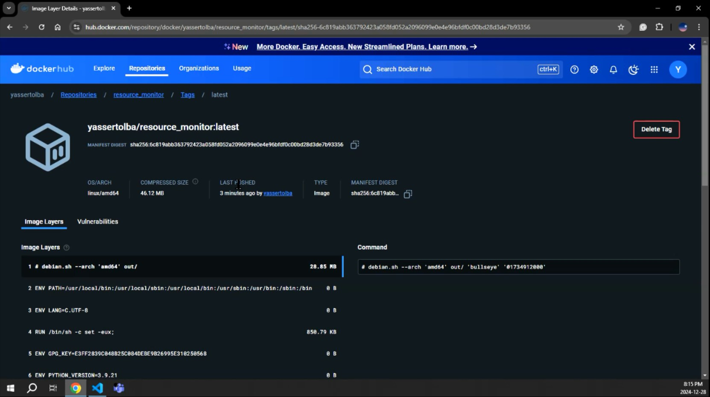
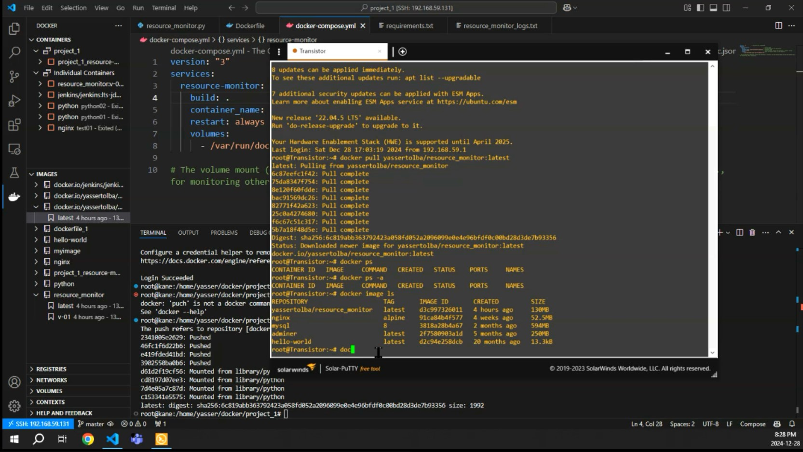

# Automating Complex Network Infrastructures

## Navigation
- [About Me](#about-me)
- [Technical Skills](#technical-skills)
- [Education](#education)
- [Licenses & Certifications](#licenses-certifications)
- [Soft Skills](#soft-skills)
- [Offered Services](#offered-services)
- [Projects](#projects)
- [Achievements](#achievements)
- [Testimonials](#testimonials)
- [Contact](#contact)

## About Me
Greetings,

My name's Yasser Ahmed, a highly skilled Network DevOps Engineer with CCNA and CCNP certifications. I specialize in automating and securing complex network infrastructures with a focus on:
- Python scripting
- DevOps tools (Ansible, Docker)
- Developing custom Python GUIs for streamlined network operations

Proven expertise in improving network monitoring, implementing robust backup strategies for network devices, and maximizing network efficiency and uptime. My experience has enhanced my skills in effective communication, problem-solving, and time management.

## Technical Skills
### Networking
- CCNA R&S 200-301 (NTI Certified)
- CCNP ENCORE
- BGP & MPLS
- Network Security, CyberOps, firewalls & VPN (NTI Certified)

### Python
- Python 3 for Networking and Network Automation

### Cloud Computing
- AWS SAA, Cloud Computing & IAC (FWD)

### Network DevOps
- Introduction to DevOps (IBM)
- Ansible
- Docker

### SDN
- Introduction to SDN

### Linux
- RHEL Admin I (NTI Certified)

### Virtualization
- VirtualBox & VMware Workstation

### Mobile Communication Technology
- GSM
- UMTS
- LTE
- WCDMA

## Education
- **National Telecommunication Institute (NTI)** - Telecommunication Post Graduate Diploma, Telecommunications Engineering (Sep 2023 - Jul 2024) - **Grade**: Excellent
- **Alexandria Higher Institute of Engineering & Technology (AIET)** - Bachelor of Engineering - BE, Electronic and Communication Engineering (Jan 2016 - Jun 2021) - **Grade**: Very good (GPA 3.2)
- **Digital Egypt Pioneers Initiative (DEPI)** - DevOps track

## Licenses & Certifications
- Professional Foundations - ALX Arabia (Issued Oct 2024)
- DevOps Fundamentals Workshop - ITIDA-SECC Software Engineering Competence Center (Issued Jul 2024)
- Introduction to DevOps - IBM (Issued Jun 2024) - Credential ID 5NKZQZH5LSB5
- Operating Systems Administration (OSA) - NTI (Issued Jan 2022)
- Red Hat System Administration I (RH124) - Redhat (Issued Jan 2022)
- Cisco Certified Network Security - Cisco Networking Academy (Issued Dec 2021)
- Cisco CyberOps Associate - Cisco Networking Academy (Issued Dec 2021)
- Network and Information Security (NIS) - NTI (Issued Dec 2021)
- CCNA v7 - NTI (Issued Nov 2021)
- CCNAv7: Enterprise Networking, Security, and Automation - Cisco Networking Academy (Issued Nov 2021)

## Soft Skills
- Very Good user of MS Office Package
- Effective Communication
- Effective Team Member
- Time Management
- Flexibility
- Organization
- Project Management

## Offered Services
- Automating network configurations
- Network monitoring and alert systems
- Custom Python GUIs for network operations
- DevOps services (e.g., Docker, Ansible)
- Cybersecurity measures and network security solutions

## Projects
### GUI Python Program
Created a text file containing the initial configuration script to make router configuration faster.

<a href="https://github.com/yassertolba/Python-Projects/tree/main/Python_Network_Automation/Initial_Configration_GUI" target="_blank">**Check out the code**</a>

### L3-VPN Configuration
Connected enterprises through service providers with MPLS, VRF, and BGP. Objective: Secure inter-branch communication.

### Dockerized Resource Monitor App
Real-time system resource insights with features like detailed logging and customization.

<a href="https://github.com/yassertolba/DEPI-R2-Marathon-1-devops-project" target="_blank">**Check out the code**</a>

## Achievements
Awards, recognitions, or publications (to be added)

## Testimonials
Include feedback from satisfied clients for social proof (to be added)

## Call to Action and Contact Information
Contact me:
- **Résumé**: <a href="https://drive.google.com/drive/folders/1QZLb1wvcIOEULS8MaPPAkqTzKQJ4tEHn?usp=drive_link" target="_blank">**Yasser Ahmed - Network DevOps engineer**</a>
- **LinkedIn**: <a href="https://linkedin.com/in/yasser-tolba" target="_blank">**/in/yasser-tolba**</a>
- **GitHub**: <a href="https://github.com/yassertolba" target="_blank">**yassertolba**</a>
- **Phone**: +201271653370 (Mobile)
- **Email**: <a href="mailto:yasser.a.tolba@gmail.com" target="_blank">yasser.a.tolba@gmail.com</a>
